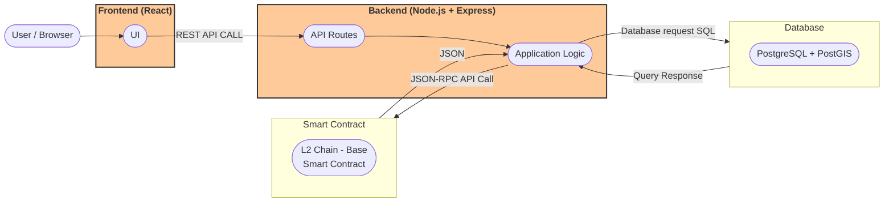

# Sprint 0 Worksheet

## HiveHand [GitHub](https://github.com/AnnaP464/COMP-4350-Group-8)

## [Presentation Slides](https://docs.google.com/presentation/d/1q339stCL1ECQrOGEpG8imXiD9Uz1BBI-26ulNVp7nAc/edit?usp=sharing)

## Architecture

## [Project Summary](https://github.com/AnnaP464/COMP-4350-Group-8/blob/main/Sprint%200/Project%20Summary.md)
