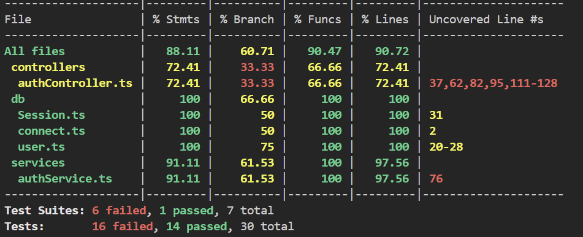
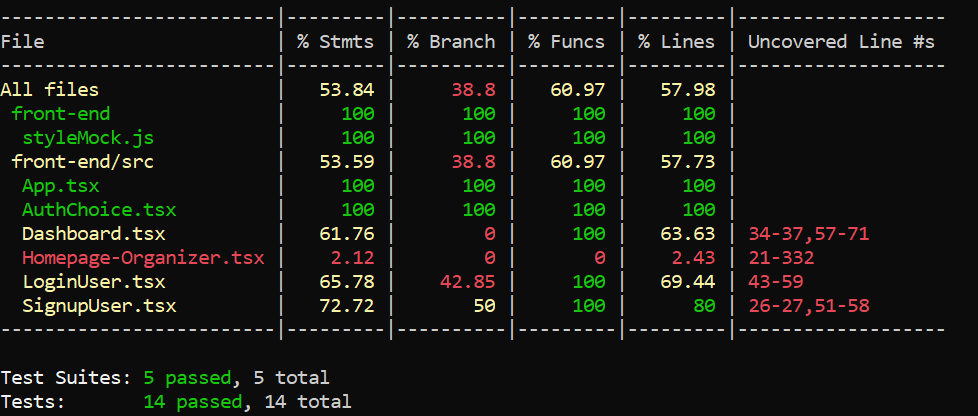
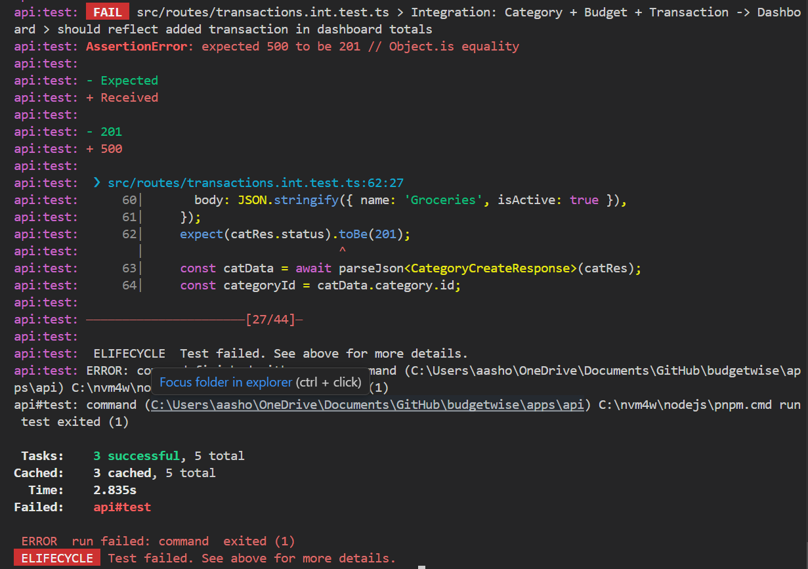
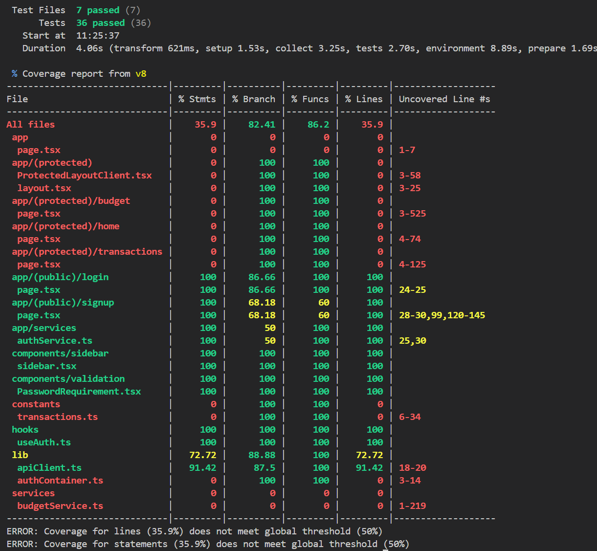
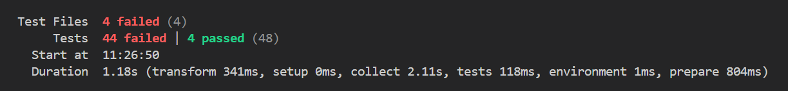
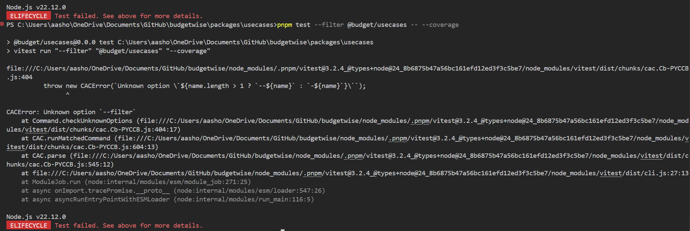

# Sprint 1 Worksheet

## [Testing Plan](https://github.com/AnnaP464/COMP-4350-Group-8/blob/main/Sprint%201/Testing%20Plan.md)

---

## Coverage Report
### Backend

the tests are mainly to test behaviour of the api, aswell as how the api interacts with the database.

### Frontend

The above image shows the test coverage for out front end which is mainly covering logic which navigates between pages

---

## Testing Importance
list 3 tests for each category and why they stand out
### Unit 


### Integration 


### Acceptance Testing
For acceptance testing the tests of note are in the /\_\_tests__/EndtoEnd.test.ts file the tests navigate throughout the entire project and display how the Organizer and Volunteer logins lead to diffirent pages with diffirent functionality, yet to be implemented. Also for the 3rd test the registartion test in Registration & Login.test.ts stands out as a test that shows a good use of database management & cleaning.

---

## Reproducible Environments

We chose to test Group 6's Budgetwise.
Installation went great, easy to use pnpm, got the environment files set up as directed after grabbing a supabase account. after running tests in mono repo mode i got this log
```
pnpm test
```
 
It is very important to note that the 500 error seems to be because the backend was not properly set up by me but i am unsureof what can be done to fix this. as i could not find a suitable fix in time, i believe in part due to my inexperience with supabase.

When run in the front-end 


When run in the api 


For these tests i was unable to get them to run in the directories of api, front-end, in the packages/domain or packages/usecases, am unsure if this is due to the test itself failing due to poor backenwd install or if the test itself failed to run, or if i was in the wrong directory.

 
```
pnpm test --filter @budget/domain -- --coverage

pnpm test --filter @budget/usecases -- --coverage
```