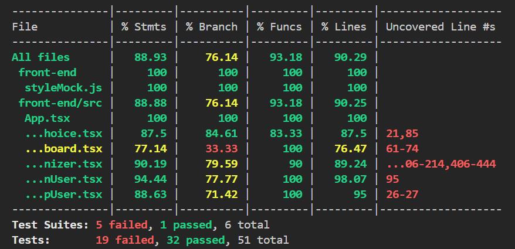

# Sprint 1 Worksheet

## [Testing Plan] ()
Our testing environment is largely centered around jest and playwright. Jest used primarily to test front-end logic and interactions between pages, and playwright for end to end tests that are done in a simulated chromium browser. The backend was also primed for testing and written with dependancy injection in mind to make it as simple as possible down the line. We have also implemented linting to make sure consistent code formatting accross the repo. All front-end, api and linting is run automatically on any push to the repo thanks to github actions.

## Coverage Report
Test coverage of the code
### Backend

### Frontend

The above image shows the test coverage for out front end which is mainly covering logic which navigates between pages, the test percentage is quite a bit lower than the tests themselves cover due to the html being imbedded in the .tsx files which lowers the coverage significantly.

## Testing Importance
list 3 tests for each category and why they stand out
### Unit 

### Integration 

### Acceptance Testing

## Reproducible Environments

We need to choose another team to test their environment