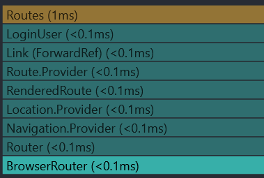
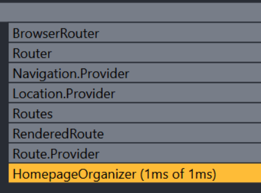

# Sprint 2 Worksheet

## Regression Testing

Since our test suite is compact and runs quite quickly we run the entire test suite when we want to test existing featues.
The way to run our test suites in root, frontend or backend directories is:

```
npm run test 
```

If running in root make sure the front and backend are booted up since the acceptance tests access the database.
---

## Changes to the Testinging Plan

Our testing plan has remained largely the same, with a few changes:

Mainly we have less coverage on the frontend pages due to how rapidly the development has outpaced testing due to the time constaints of this sprint.
Otherwise the testing plan has remained the same, unit, integration, and acceptance tests are going to be updated to match the current version of the project at the beginning of sprint 3.

---

## What Parts We Are Not Testing

A system architecrure document is present in the backend of our project: [ServerArchitecrure.md](https://github.com/AnnaP464/COMP-4350-Group-8/blob/main/backend/ServerArchitecture.md)

We will go over the coverage of each layer here.

e

The overall average of the project is 41% that is quite a bit lower than at the beginning of this sprint. A major reason for this decrease is due to the integration tests not working. The middleware layer only serves to help other layers do their authentication and is tested relative to other layers. Also the end to end & acceptance tests do not print out a coverage test because the tests actually click through the application as it is rendered.

---

## Profiler

We need to run a profiler on our api to test every end point for speed and which can be sped up and why or why not.
Also a pic of the profiler output
Here we can see the activity after clicking submit on a valid user registration form: 


Unfortunately since this is being run on docker containers that are local the response times are nearly instantanous, and it seems the only load times are the fetching of the page itself since that is a larger file than the json packages fetch sends and recieves. The profiler displays nearly identical results for all other pages regarless of function performed, all taking <1ms and in the case of a page load taking 1ms. as you can also see when organizer home page loaded:



---

## Last Sprint

Between sprints 1 & 2 the most challenging aspects of development have changed. At the beginning of the project it was defining what we are capable of finishing in time for submission, due to the structure of the project needing to be setup first. For sprint 2 we have spent a larger amount of time on fixing issues with our rapidly expading feature set & infrastructure, like tests working locally but not through github actions, or the way that docker doesnt setup the same way between ARM and x64 processors. As weve taken on more tech-debt we have had to devote a larger amount of time to testing & debugging than previously and we will likely lessen this trend for sprint 3. Due to how Docker will soon host our testing suite and the goals in terms of final funtionality have become clearly visible, we dont expect scope creep to be a contributing factor to our tech debt and we can really hone in the tests all passing & code being cleaner. A large part of our time will be dealing with the prudent type of tech debt that has accrued already.

---

## Code Gallery

### Anna Pavlova
I am proud of the this [commit](https://github.com/AnnaP464/COMP-4350-Group-8/commit/3268f6d56a5012ad19c4a5f3b0717a3cb2b765ac).
I implemented a feature for signing up for events that touched all layers of our project. Frontend logic to send the request, authentication, routing, logic and database are all involved, the feature worked as expected and though a console.log() is present for on the go debugging i think it shows my grasp of the structure of our project. Specifically i want to note the changes made to routes/events.ts, this file contains the @swagger comments which define our api and it was a challenge to understand how exactly to connect the backend and frontend before this file made sense in its' role of defining end points. 

### Noah McInnes

### Sudipta Sarker