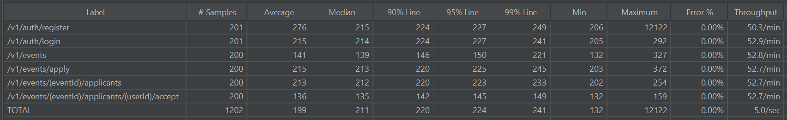
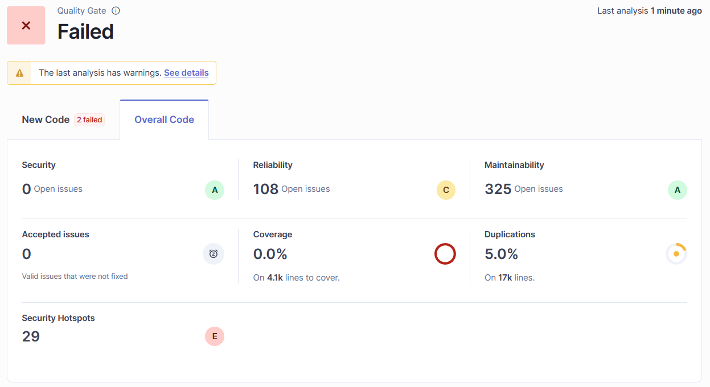
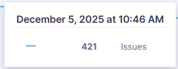
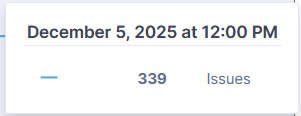

# Sprint 3 Worksheet

# [HiveHand](https://hivehand-frontend.ambitiousflower-23c258c4.westus2.azurecontainerapps.io)

## Load Testing

Using JMeter, the .jmx file [HERE](https://github.com/AnnaP464/COMP-4350-Group-8/blob/main/Sprint%203/DeployedURLReal.jmx)

This profiler covers an organizer creating an event and then accepting volunteers for it. The event does not start, however the applicants are all registered and are ready to start the event.

Report for 1 Organizer creating 1 event and 200 volunteers all applying to it. A baseline to see how the end points behave with 1 request at a time.

Report for 10 organizers creating 10 events with 50 volunteers applying to each.
A more realistic usecase in case of a traffic surge.

The overall profile is quite flat, though the registration endpoint does acrew an incredibly high 1st entry due to having to wait for a connection to be established to the server. Most of the information being sent is simple strings for tokens, email, password and username, all end points perform similarly due to lack of complex queries behind each individual endpoint.

These results show that we do meet the functional requirements as the throughput of the endpoints falls with-in the established goal of 20 users with a total of 200 requests per minute concurrently.

## Security Analysis

We used SonarQube to run the security analysis. 
In terms of Security vulnurabilites none were found. It did highlight many maintainance & reliability issues.

Overall Report:

All Security Hotspot issues are the hardcoded passwords in the test suite that are used for login.

Coverage does not register due to unknown reasons even though the coverage folder has been updated with the latest test, this is also the reason the overall assessment is set to Failed.

Before removing comments:

After:

Here are the commits for resolving said comment issues

[Commit 1](https://github.com/AnnaP464/COMP-4350-Group-8/commit/16876c7122542fc2ae431547e03511a6b4a35c60) & [Commit 2](https://github.com/AnnaP464/COMP-4350-Group-8/actions/runs/19971862935)

And here is a fix for cognitive complexity being evaluated as too high for a function.

[Commit](https://github.com/AnnaP464/COMP-4350-Group-8/commit/f67385704308405a9387f131b9bfc399bdb7f7db)

## Continuous Integration & Deployment

For CI we use github actions to check out the front or backend and then the tests are run using the same commands as if you were running the tests locally. For the sake of integration tests the backend is loaded with a postgis docker image to simulate the database. For our acceptance tests that run on playwright the entire system is setup inlcuding database backend and frontend and then playwright clicks through the application.

For CD

[Continous Integration](https://github.com/AnnaP464/COMP-4350-Group-8/blob/main/.github/workflows/main.yml)

[Continous Deployment]()

## Reflections

### Design Changes

Mapping out the User Interface before beginning of development would have prevented the need for the refactors that came later. If the structure of the frontend was determined before it came time to implement the endpoints we could have agreed on a universal design for our app that used and reused the same ui elements between the Organizer and Volunteer pages in a way that didnt require much modification from one to the other. We had to dedicate an effort towards refactoring the frontend flow in sprint 2 and in sprint 3 due to feedback we recieved in our 2nd Demo and general reworking of the HomepageOrganizer & Dashboard pages to be more similar in layout, to prevent users needing to relearn the flow of the app if they happen to be both a Organizer and a Volunteer.

### Project Setup Changes

Our work setup has always relied on in person or discord meetings to assign tasks and summarize the state of the repo. The Largest changes to the project's scope came after sprint 1 when we scaled back the feature set quite a bit to rely less on third party technology like blockchain and to focus on building the skeleton of the app first and foremost.

The branch management strategy of sprint 1 did not last into sprints 2 & 3. There were a few collisions & instances of double work that made us reconsider how we update eachother on what features are being handled and we started to rely more on github issues to make sure we are aware of the project state before beginning development of the next feature.

### Individual AI / External Resource Reflection

Required: one clearly labeled paragraph per team member, even if you did not use AI.

  If you used AI or external references: Given an example of a problem you tried to solve, what did the tool produce (summary is fine), and what did you rewrite, validate, or learn from its response?

  If you did not use AI: Why not? What influenced that choice, and how did you approach problem-solving instead?

  Length guideline: approximately 5–8 sentences. Focus only on your own actions and understanding.

#### Anna P
The AI I used is ChatGPT 5.0, I relied on it to help me learn how to create the .yml files for CI using Github Actions. The code it produced can be seen in out technique sharing seminar and overall it made tons of assumptions about the structure of our code that were not supported by anything concrete, it assumed the paths that it chose to ping, it eventually sudgested caching of an install of Playwright on a docker image in CI, and similar changes that did not help with the real issue of it trying to ping a path that did not exist. The second attempt at fixing the .yml file was much more fruitful due to writing the file myself and arranging all of the pieces of the workflow myself and only using AI to help parse Azure Server's Error messages, along with minor code sudgestions. The second attempt was a lot faster due to becoming familiar with Docker, I think AI cant bridge this knowledge gap due to how opaque the project is to it, not unless I were to paste the entire repository into the chat window.
